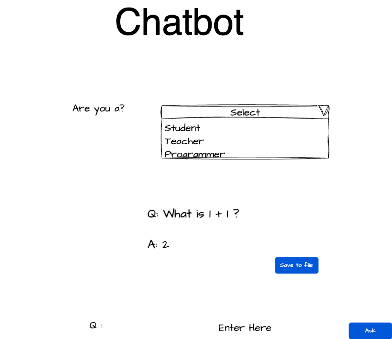

# Chatbot


#### Prototype


#### Design


### How to get Anthropic API Key
https://www.anthropic.com/api
Follow the steps on the anthropic site and get API key and update the key in application.properties under src/main/resources
```
anthropic.api.key=<<Your_API_KEY>>
```
This application uses claude-3-sonnet-20240229 model, you can also update the model in ClaudeApi if you want to use a different model.

### Running in Docker Desktop
Install [Docker Desktop](https://www.docker.com/products/docker-desktop/) in your local machine and run below command(s).
```
docker build -t chatbot .
docker run -p 8080:8080 chatbot
```

or

```
docker-compose up
```

To access application use http://localhost:8080

Other links

http://localhost:8080/hello

http://localhost:8080/v3/api-docs

http://localhost:8080/swagger-ui/index.html#

